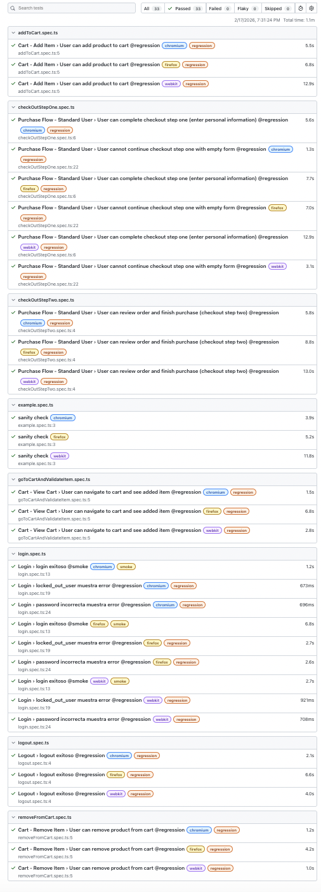

# Playwright + TypeScript | SauceDemo E2E Portfolio

[](https://github.com/MauricioSabajMorales/playwright-saucedemo-e2e/actions)


End-to-End (E2E) automation project using **Playwright + TypeScript** on the practice app **SauceDemo** (https://www.saucedemo.com/).  
It includes **login, cart, and checkout scenarios**, applying the **Page Object Model (POM)** and reuse through **custom fixtures** and **helpers**.

---

## 👨‍💻 About Me

QA Engineer with 3+ years of experience in software testing, including strong expertise in accessibility testing, especially on mobile platforms.

My background includes functional, exploratory, and accessibility validation, ensuring inclusive user experiences across devices.

Currently expanding into Automation Engineering with focus on:

- Playwright + TypeScript test automation  
- CI/CD integration with GitHub Actions  
- API testing  
- AI Model Testing (in training)  

My goal is to grow into a QA Automation / SDET role while combining automation, accessibility expertise, and modern testing practices.

---

## ✅ What This Project Validates

### Login
- Successful login **(@smoke)**
- Locked-out user displays error message **(@regression)**
- Incorrect password displays error message **(@regression)**

### Cart
- Add item **(@regression)**
- View cart + item validation **(@regression)**
- Remove item **(@regression)**

### Checkout
- Step One: complete user information **(@regression)**
- Step One: negative validation (empty form) **(@regression)**
- Step Two: review and complete purchase **(@regression)**

---

## 🧰 Tech Stack
- **Playwright**
- **TypeScript**
- **POM (Page Object Model):** Each page is abstracted into dedicated classes inside `/pages` (e.g., `LoginPage`, `InventoryPage`, `CartPage`, `CheckoutPage`) to improve maintainability and readability.
- **Custom fixtures** (`base.extend`) for reusable context
- **Helpers** for navigation and scenario setup

---

## 🚀 How to Run the Project (Quick Start)

### Prerequisites
- Node.js 18+ (20 recommended)
- npm

### Installation
```bash
npm ci
npx playwright install
```

---

## 🤖 Continuous Integration

This project includes **GitHub Actions** to automatically run the tests on every push to `main`.

- Runs tests in a Linux environment  
- Installs Playwright and browsers  
- Executes the full test suite  
- Fails the pipeline if any test fails  

This simulates a real-world Continuous Integration (CI) environment.

---

## 📊 HTML Report (Sample Execution)

The HTML report shown below is generated automatically by Playwright after test execution.  
It is **not part of the Page Object Model architecture**, but a built-in reporting feature used to visualize execution results.

Example of a full execution across 3 browsers (Chromium, Firefox, and WebKit):



---

## 🧱 Repository Structure

```text
/tests        # specs
/pages        # Page Objects (POM)
/fixtures     # custom fixtures (test extension)
/utils        # helpers (navigation/setup)
/data         # test data (users.json)
playwright.config.ts
```